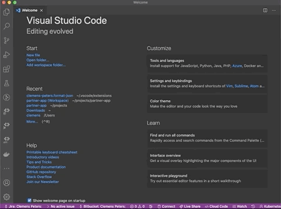

# JSON Formatting Extension for Visual Studio Code

Just run `Format JSON` to set the language of the current  
file to JSON and format the content in one step.  
Also works in new Untitled (not saved) files.

## Usage

## Background

Before I always did

1. `Cmd + K` and then `M` to complete the command
2. Type JSON
3. Hit Enter
4. `Option + Shift + F` to format the content

Now it is just `Cmd + Shift + P` and then `Format JSON`.

## Privacy

This extension does not collect, transmit, or store any personal data or telemetry.  
All operations run locally in your editor.
